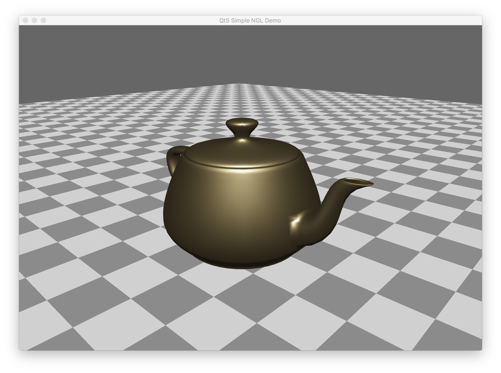

# SimpleNGL 

This is the most basic version of an NGL demo, it creates a simple window in Qt and allows
the manipulation of the teapot using the mouse.

This uses a simple PBR shader based on code from [here](https://learnopengl.com/PBR/Theory) 

